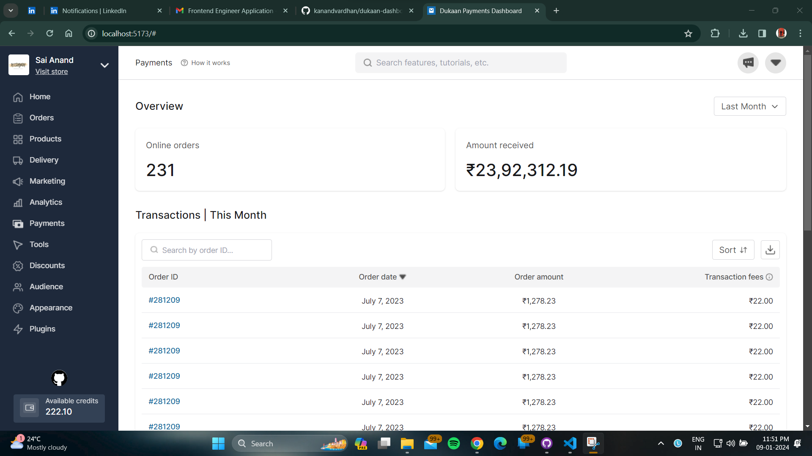

# payments_cashfree_dashboard_figma_design

Check out the design demo [here](https://www.figma.com/file/1QTpfgcJLng3SEHv3V7Nr4/Payouts-V2---2023?type=design&node-id=0-1&mode=design&t=Avd1bIuniWAwYIg3-0).

## Description

This repository contains the React implementation of the payments_cashfree_dashboard as part of the Dukaan Frontend Engineer assignment.

## Live Demo

Check out the live demo [here](https://dukaan-dash-pay.netlify.app/).

## Screenshots

## Installation

1. Clone the repository: `git clone https://github.com/your-username/payments_cashfree_dashboard.git`
2. Navigate to the project directory: `cd payments_cashfree_dashboard`
3. Install dependencies: `npm install`

## Usage

1. Run the application: `npm run dev`
2. Open your browser and visit: `http://localhost:5173`

## Technologies Used

- React + Vite + Tailwind CSS

## Folder Structure

Folder structure is developed as per industry standards

## Contact

For inquiries or feedback, please contact: [kanandvardhan@gmail.com](mailto:kanandvardhan@gmail.com) [kanandvardhan@yahoo.com](mailto:kanandvardhan@yahoo.com)
